# Mainline Visual Walkthrough

*A page-by-page guide to every feature.*

Version 0.8.0 | March 2026

---

## PART 1: The Essentials

*The pages you'll use every day.*

### Dashboard

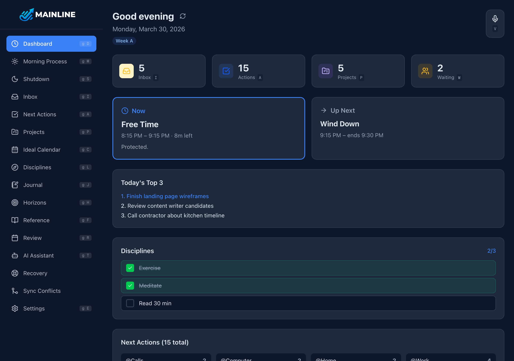

Your home screen. Everything important at a glance.

- **Quick Stats** --- inbox count, active actions, projects, and waiting items
- **Now / Up Next** --- your current and next calendar block
- **Top 3** --- today's priorities (set during Morning Process)
- **Disciplines** --- tap to check off daily habits
- **Next Actions** --- action counts per context list
- **Daily Calendar** --- today's schedule from your Ideal Calendar template
- **Voice Capture** --- the mic button (top right) captures thoughts to your inbox

### Inbox

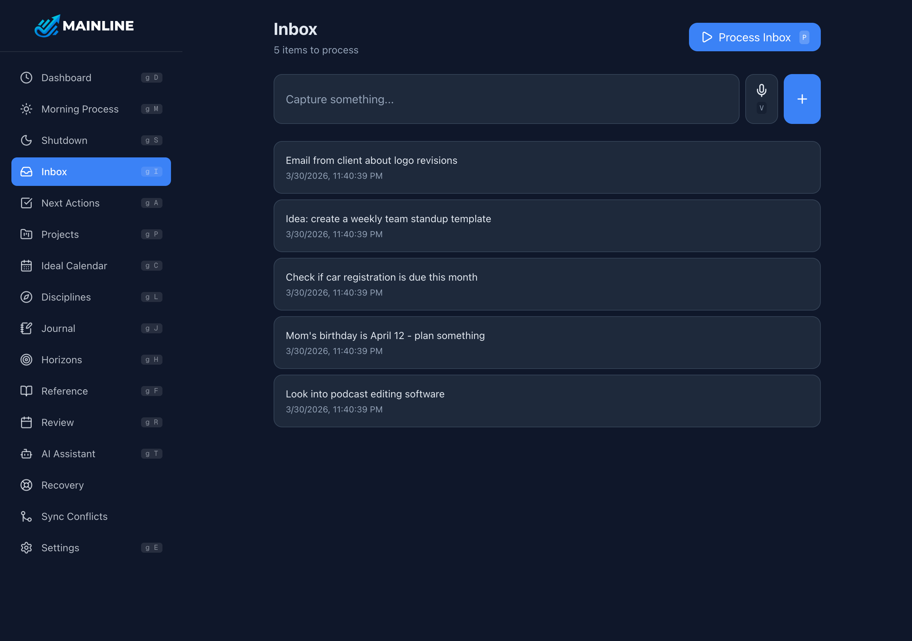

Where everything gets captured before you decide what to do with it.

- **Type or talk** --- use the text input or mic button to add items instantly
- **Process Inbox** --- when items are waiting, tap this to work through them one by one

Items show their capture time. Don't organize here --- just dump and move on.

### Inbox Processing

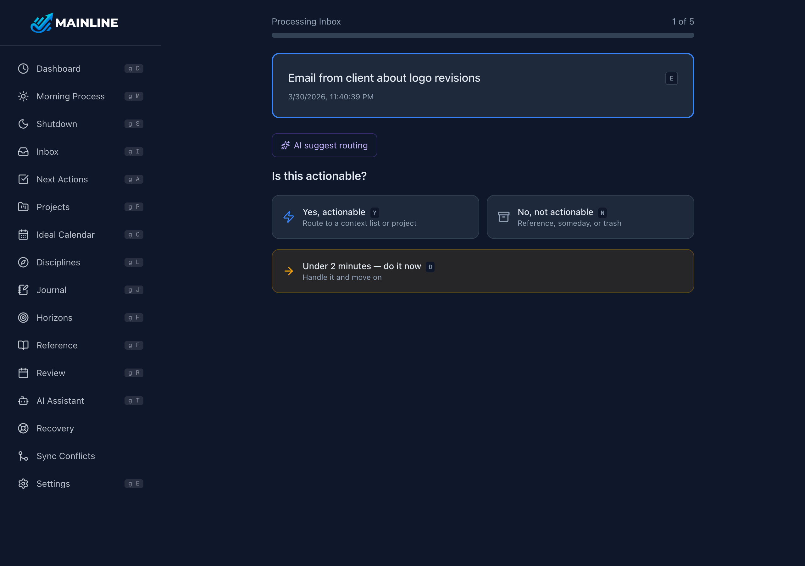

The decision tree --- one item at a time.

- **Is it actionable?** --- Yes, No, or "Under 2 minutes --- do it now"
- **If yes** --- refine the text, pick a context list, or create a project
- **If no** --- trash it, save to Someday/Maybe, or file in Reference
- **AI suggestions** --- the AI can suggest routing and rewrite vague actions
- **Keyboard shortcuts** --- Y/N for actionable, 1--8 for contexts, T for trash, S for someday

### Next Actions

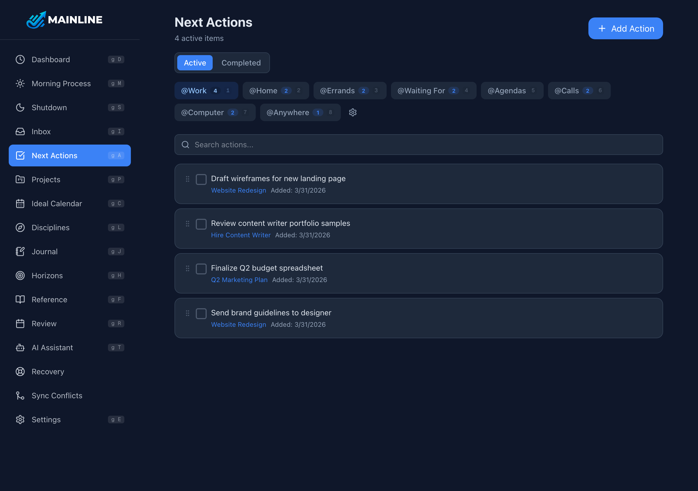

Your action lists, organized by context --- where you are or what tool you need.

- **Context tabs** --- @Work, @Errands, @Home, @Waiting For, etc. (fully customizable)
- **Action counts** --- badge on each tab shows how many items are in that context
- **Complete** --- check the box to mark done. Switch to Completed tab to see history.
- **Drag to reorder** --- prioritize within each list
- **Gear icon** --- add, rename, reorder, or delete context lists

### Projects

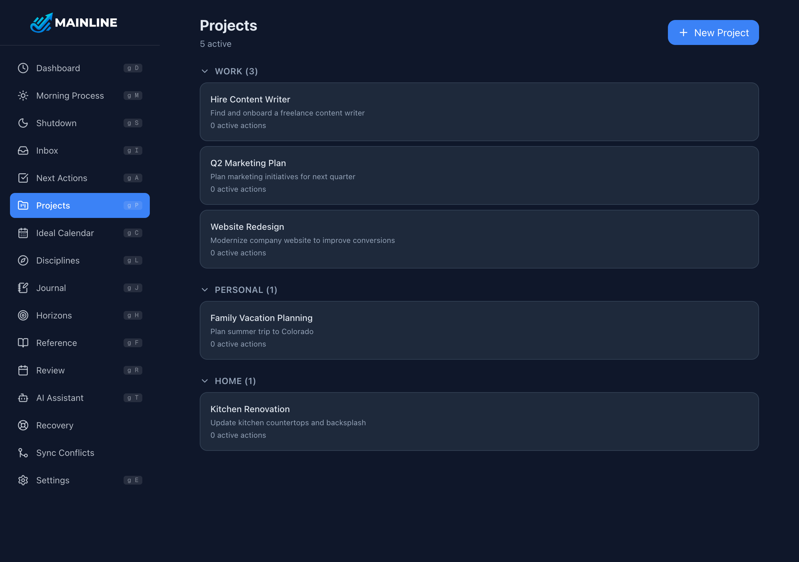

Anything requiring more than one action step.

- **Each project shows linked next actions** --- click to see details
- **Stalled projects** --- no next action? A red alert appears here and on the dashboard

Create projects with a title and category. Add purpose, milestones, and notes on the detail page.

### Morning Process

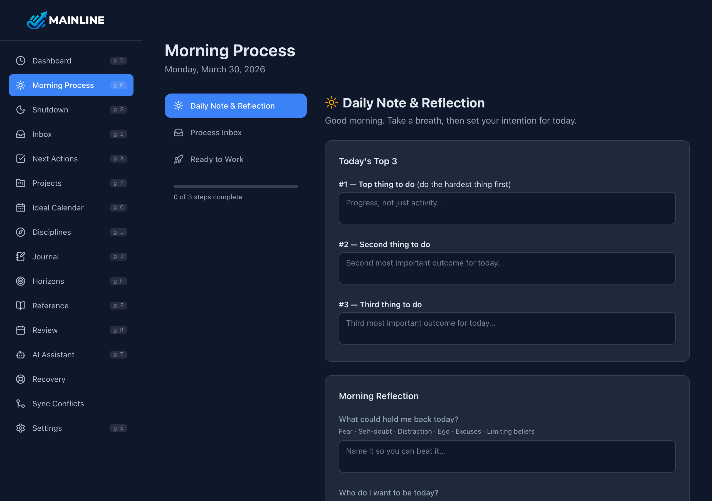

Your daily startup routine (~15 minutes). Three steps:

1. **Daily Note & Reflection** --- set your three priorities and answer two reflection prompts
2. **Process Inbox** --- work through every captured item from yesterday and this morning
3. **Ready to Work** --- animated checkmark, then back to the dashboard

### Shutdown

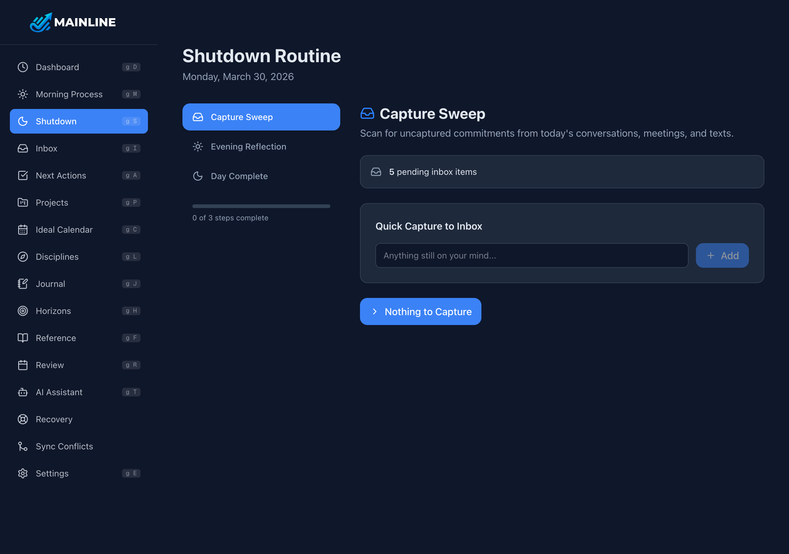

Your daily wind-down (~10 minutes). Four steps:

1. **Capture Sweep** --- anything still in your head? Dump it into the inbox now.
2. **Discipline Review** --- review your disciplines and values for the day. Items checked off on the dashboard are pre-marked. Toggle any remaining ones.
3. **Evening Reflection** --- see your morning intentions, then answer: what went well, what didn't, what to do differently tomorrow
4. **Day Complete** --- animated checkmark. Your mind is clear. Enjoy your evening.

---

## PART 2: Going Deeper

*Features you'll discover as the system becomes second nature.*

### Ideal Calendar

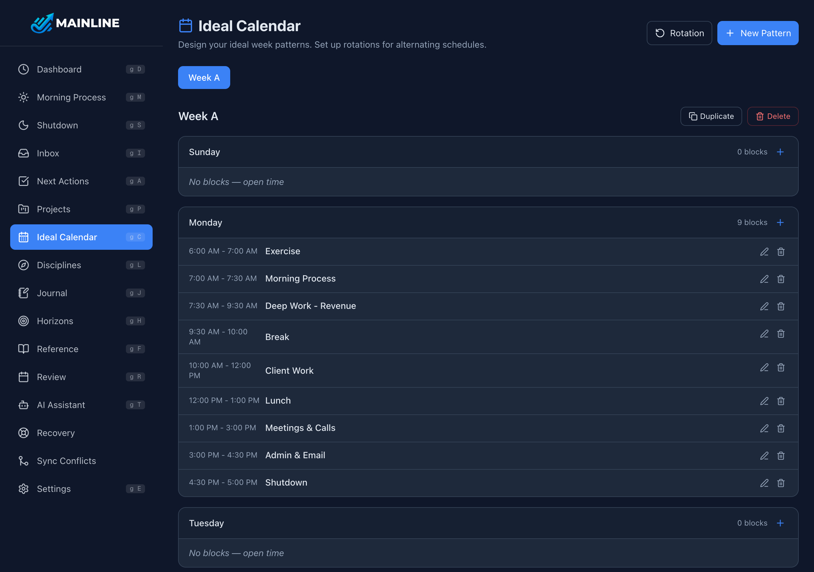

Design your ideal week. Create template patterns (Week A, Week B) with time blocks for each day.

- **Blocks copy to your dashboard** each morning --- editable for that day only
- **Rotation** --- set up automatic bi-weekly (or multi-week) rotation

This is how your week should look. Reality adjusts daily; the template stays stable.

### Disciplines & Values

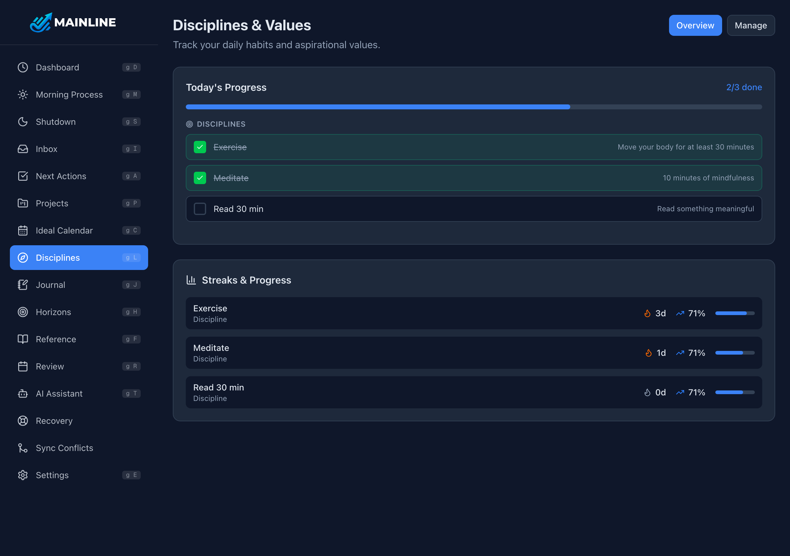

Daily habits you want to track. No guilt, no gamification.

- **Tap to check off** from the dashboard or this dedicated page
- **Streak count** and 30-day completion rate for each discipline
- **Shutdown review** --- evaluate your disciplines and values as part of the nightly shutdown

Add or remove disciplines anytime. The app is a mirror, not a judge.

### Journal

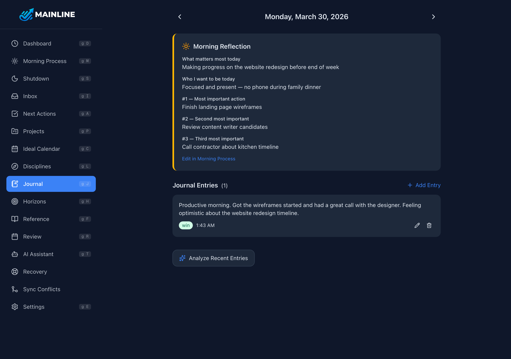

Daily reflection and free-form writing.

- **Morning & Evening Reflections** --- show as read-only cards from your daily flows
- **Journal Entries** --- write as many as you like, with optional tags (gratitude, idea, lesson, goal, win, struggle)
- **Date navigation** --- browse any day with arrows or the date picker
- **AI Insights** --- analyze 14 days of entries for recurring themes and patterns

### Horizons

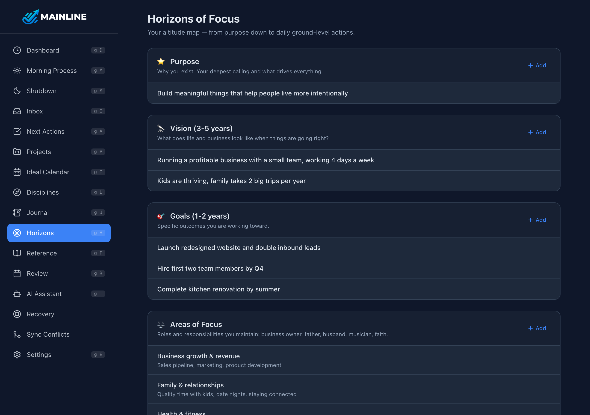

Big-picture alignment --- 5 levels from ground to sky:

- **Purpose** --- why you exist
- **Vision** --- what you're building toward (3--5 years)
- **Goals** --- 1--2 year specific outcomes
- **Areas of Focus** --- ongoing roles and responsibilities
- **Growth Intentions** --- skills and character traits you're developing

Review during monthly reviews to ensure daily work connects to what matters most.

### Reference

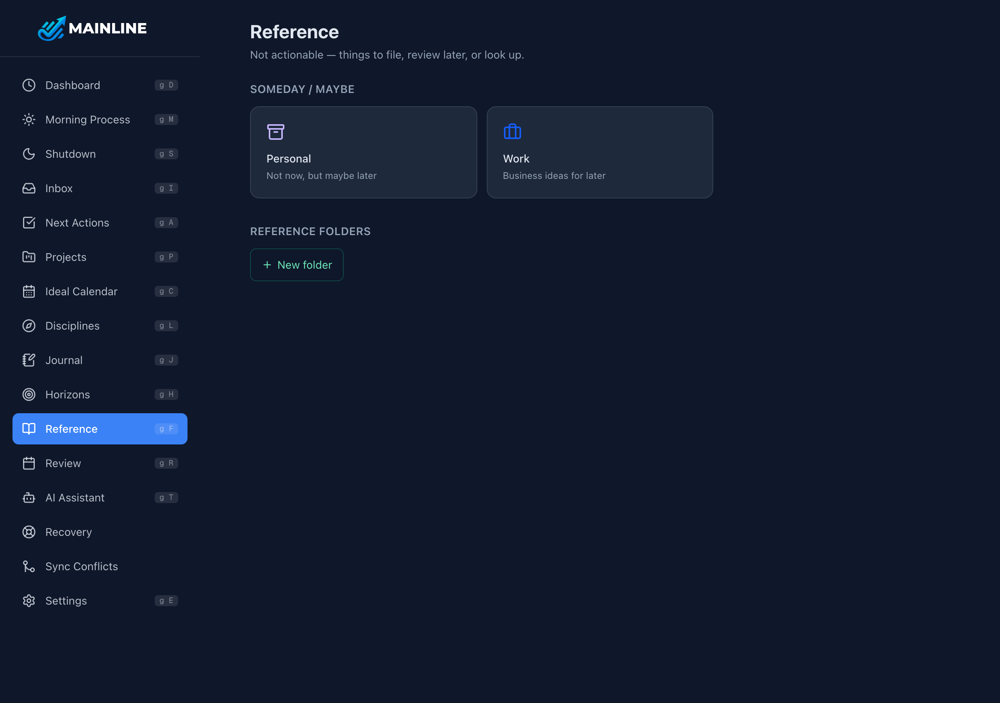

Non-actionable stuff worth keeping.

- **Someday/Maybe** --- Personal and Work categories for ideas whose time hasn't come yet
- **Reference Folders** --- create your own folders for filing notes and links

Reviewed monthly during the deep review.

### Review

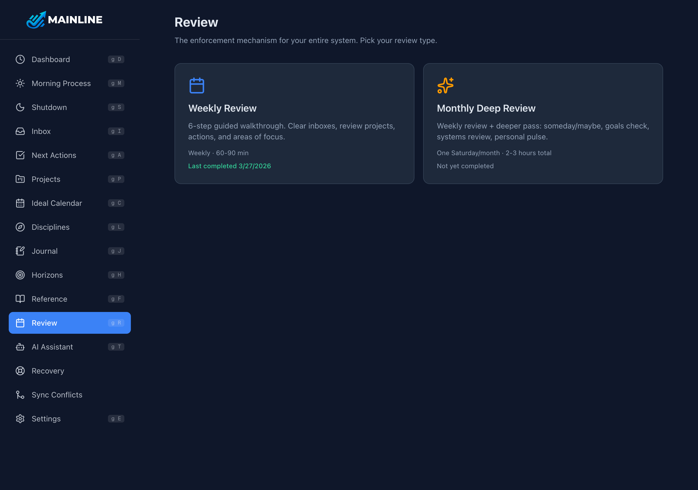

The guided review that keeps your system trustworthy.

- **Weekly (6 steps)** --- clear inboxes, review projects, check action lists, calendar, and areas of focus
- **Monthly (10 steps)** --- weekly steps + Someday/Maybe, goals, systems check, and personal pulse

The app tracks when you last reviewed and nudges you when overdue.

### Settings

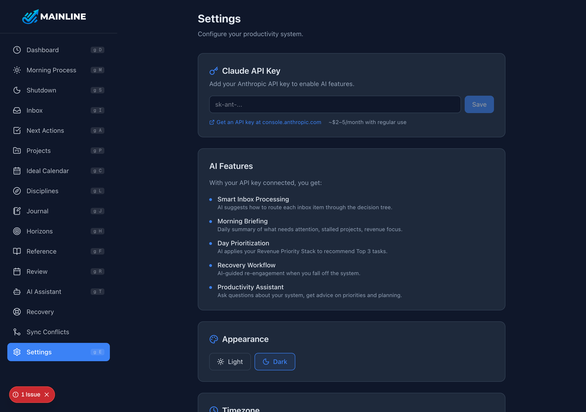

Customize your instance.

- **Dark Mode** --- toggle between dark and light themes
- **Timezone** --- affects how "today" is calculated
- **API Key** --- add your Anthropic key to enable AI features
- **Export / Import** --- full data backup as JSON
- **Change Password** --- all sessions are invalidated immediately
- **Check for Updates** --- see if a new version is available

---

*That's the whole app. Now go run your day.*
